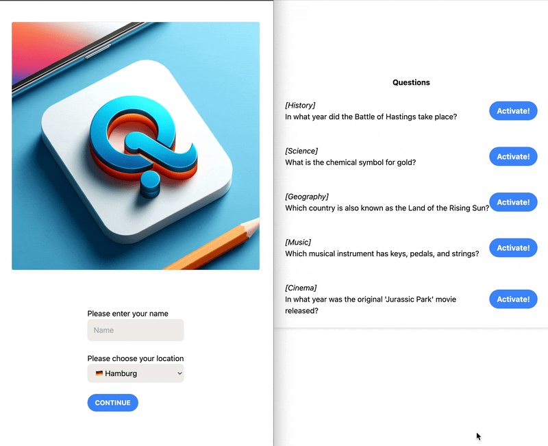

# Qlyx - Live Quiz App


## Prerequisites

You need

 - NodeJS
 - Bun (https://bun.sh)
 - Turso Account (https://turso.tech/) + Turso CLI (https://github.com/tursodatabase/turso-cli)

## Setup

You need a database. The driver currently works with SQL-lite in Turso. You can create a db after logging into Turso via the CLI

```bash
turso auth login
turso db create $(QLYX_DB_NAME)
turso db tokens create $(QLYX_DB_NAME) # gives you the DATABASE_PASSWORD / JWT
turso db show $(QLYX_DB_NAME) # gives you the DATABASE_URL
```

For running it locally you can put those in a `.env` file (use the `.env.template`) and run `source .env` to add them to your current terminal session.

```bash
bun install
bun run db:push # apply db migrations
bun run dev
```

## Usage

### Adding questions

Currently you connect to the database and add questions manually. There is a set of [`example-questions.sql`](/example-questions.sql) that you can use as a template. Then

```bash
turso db shell $(QLYX_DB_NAME)
```

Then paste the `INSERT` statements into that shell and hit ENTER.

### Backend

In order to "play" the quiz you need a moderator who actively activates questions. There is no auto-mode.
This app is designed for a session in which you can talk and control how the quiz will flow.

In order to control the quiz go to the backend admin page. In local development you will find it under <http://localhost:3000/backend/adm>. You then need to set the `ADM_PWD` cookie to your password configured in the `ADM_PWD` environment variable. If you don't have any, simply set `ADM_PWD` to an empty string.

### Quiz

As a user you find the quiz simply on the root path of your app. In local development this is simply <<http://localhost:3000/>.

This GIF should explain quite well how the Quiz should work. On the let is a user, on the right the moderator who can activate questions.



### Leaderboard

The leaderboard can be found under <http://localhost:3000/ldb>. You can protect the leaderboard, then you will need the `ADM_PWD` cookie similar to the `/backend/adm` page.

## Deploy

‼️ The current version does poll a lot, so you should have a decent amount of compute. Every user polls every second. I might add some caching in future versions.

### render

Simply push your version into a git repository and connect it with <https://www.render.com>.

You then configure the environment in your render dashboard.

### Cloud Run

You need a GCP project with access to Cloud Run and gcr. Then

```bash
docker build . -t qlyx:1.0.0
docker push gcr.io/$(GCP_PROJECT)/qlyx:1.0.0
# update qlyx.yaml to use the image you just pushed
gcloud run services replace qlyx.yaml
```

Make sure to set the enviornment in the `qlyx.yaml` appropriately.
